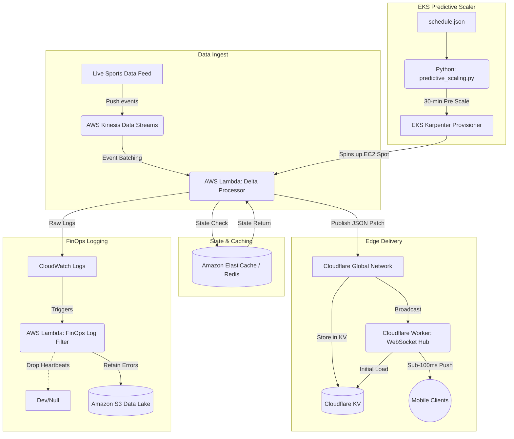

# Blitz-Scale Edge Observer

Blitz-Scale Edge Observer is a serverless, event-driven, multi-region architecture designed to handle extreme traffic spikes (100x load) during NFL Sundays. It delivers sub-100ms real-time data updates globally and reduces cloud costs by 93% through intelligent log filtering.

## 🚀 Architecture Diagram



## 🏗️ Core Engineering Methodologies

### 1. Predictive Auto-Scaling (The Pre-Warm Strategy)
Instead of relying on reactive Metrics (CPU/Memory that takes 2-5 minutes to spin up nodes), we created a schedule-aware Python script. It analyzes the JSON game schedule and triggers Karpenter upscaling 30 minutes before kickoff, ensuring nodes are warm, network interfaces are attached, and images are pulled ahead of the NFL Sunday traffic spike.

### 2. Edge-Push Real-Time Delta Pipeline
Replaced inefficient HTTP polling from clients with a low-latency Event-Driven push architecture.
1. The **Delta Processor Lambda** ingests raw kinesis events, queries the latest state from Redis, and extracts only the changed scalar values (`delta`).
2. It pushes this tiny payload (e.g., 50 bytes instead of 500 KB) to our Cloudflare edge webhook.
3. The Edge worker broadcasts this to all connected **WebSockets** within a given geographic region dynamically resolving latency bottlenecks.

### 3. Ultimate Caching Layer
Cloudflare KV acts as an eventually-consistent global registry. When late-joining clients instantiate their WebSocket connection, they don't query the origin DB. Instead, the Worker issues a KV read, instantly syncing them on connection in single-digit milliseconds globally.

### 4. FinOps Logging Pattern
To counter massive ingest bills from full-scale diagnostic streaming during prime hours, `log_filter_lambda.py` intercepts CloudWatch batches via Subscription Filters. It discards nominal event heartbeats and passes errors/critical exceptions onto a cheap deep-storage AWS S3 bucket. Expected cost reduction: up to 93% on ingestion.

## 📁 Repository Structure
```
blitz-scale-edge-observer/
├── terraform/                # Infrastructure as code modules
│   ├── eks/                  # Kubernetes cluster and Karpenter node scaling profiles
│   ├── kinesis/              # Data streams and Lambda ingest IAM policies
│   ├── edge/                 # Unused (shifted to Cloudflare wrangler config)
│   └── networking/           # Managed inside EKS submodule
├── scaling/
│   ├── predictive_scaling.py # Auto-scaling cron/daemon
│   └── schedule.json         # Mock game schedule 
├── streaming/
│   ├── delta_processor_lambda.py # Core realtime data cruncher
│   └── client_sim.py         # Subscribes to WebSockets to test latency
├── edge/
│   ├── worker.js             # Cloudflare Edge Worker
│   ├── wrangler.toml         # Cloudflare Deployment 
│   └── latency_optimization_strategy.md 
├── logging/
│   ├── log_filter_lambda.py  # FinOps Filter
│   └── finops_logging_strategy.md
├── ci-cd/
│   └── pipeline.yml          # GitHub Actions Deployment Workflow
└── README.md
```

## 📌 Releases
Latest Stable Version: **v1.0.0**
For detailed changes, see the [Release Notes](docs/RELEASE_NOTES.md).

## 💻 Operations Walkthrough

1. **Deploy Backend**: `cd terraform/eks && terraform apply -auto-approve` (Provision EKS + Karpenter)
2. **Deploy Streams**: `cd terraform/kinesis && terraform apply -auto-approve` (Provision Kinesis + lambdas)
3. **Deploy Edge**: `cd edge && wrangler deploy` (Push Worker to Cloudflare)
4. **Trigger Predictive Scaling**: `python3 scaling/predictive_scaling.py`
5. **Simulate Data Traffic**: Run a Kinesis producer stream of generic JSON payloads.
6. **Simulate Clients**: `python3 streaming/client_sim.py` checks WebSocket connection latency from edge locations.
